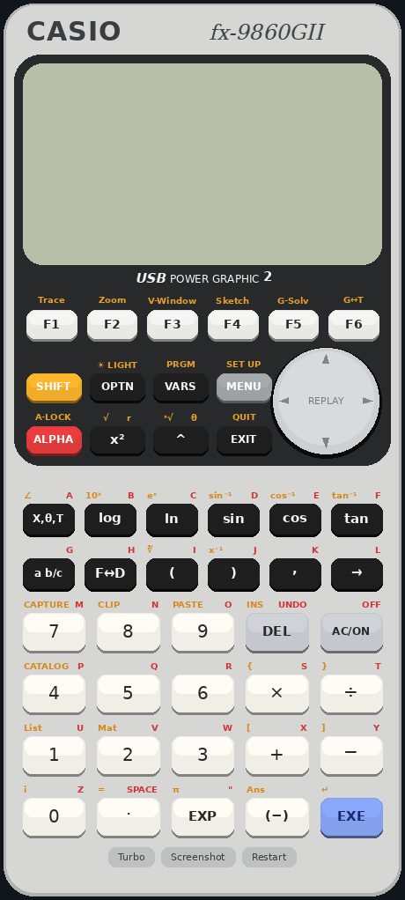

# fx-9860GII-2 – Firmware-Dump und Emulator

Für dieses Projekt habe ich die Firmware meines CASIO fx-9860GII-2 ("USB POWER GRAPHIC 2",
Hardware-ID `Gy363007`, OS 02.09.0201) ausgelesen und einen Emulator geschrieben, der sie
unverändert ausführt, vom Bootloader bis zum Betriebssystem.

Die Firmware selbst ist nicht enthalten, da sie CASIO gehört. Wer den Emulator nutzen
möchte, benötigt einen Dump des eigenen Rechners; mein Vorgehen dazu beschreibe ich
[unten](#auslesen-der-firmware).



## Nutzung

1. Dump als `dump/fx9860gii2_full_4MB.bin` ablegen.
2. Emulator [bauen](#bauen); die Firmware wird dabei in die exe eingebettet.
3. Die exe starten.

Der erste Start bootet den Rechner in etwa 8 Sekunden. Beim Schließen des Fensters wird
der komplette Zustand gespeichert, beim nächsten Start geht es an derselben Stelle weiter.
SHIFT + AC/ON schaltet aus, AC/ON wieder ein. Es läuft stets nur eine Instanz.

| Eingabe | Funktion |
|---|---|
| Maus | Tasten anklicken; Pfeile über den Rand der REPLAY-Wippe |
| `0`–`9` `+ - * / ( ) ^ . ,` | direkte Eingabe |
| Enter / Backspace / Esc | EXE / DEL / EXIT |
| Pfeiltasten, F1–F6 | wie am Rechner |
| `M` / Pos1 / Tab | MENU / AC/ON / ALPHA |
| `s` `c` `t` `l` `x` `e` | sin / cos / tan / ln / X,θ,T / EXP |

SHIFT ist nur per Maus erreichbar, da die Umschalttaste des PCs für `(` und `*` gebraucht
wird. Unten im Fenster befinden sich **Turbo** (volle Geschwindigkeit), **Screenshot**
(PNG im Bilder-Ordner) und **Restart** (Neustart, Dateien bleiben erhalten). Das Fenster
passt sich beim Start der Bildschirmhöhe an und lässt sich frei skalieren.

Der emulierte Flash (`flash.bin`) und der gespeicherte Zustand (`state.bin`) liegen in
`%APPDATA%\fxemu\`. Wird der Ordner gelöscht, startet der Rechner wieder im Zustand des Dumps.

## Auslesen der Firmware

Voraussetzungen: ein fx-9860GII-2 mit 4 MiB Flash, ein Mini-USB-Datenkabel, Windows mit
Python 3 und [Zadig](https://zadig.akeo.ie/).

Das Link-Protokoll des Rechners kann den Flash nicht lesen. Ich habe deshalb das Add-in
`romdump/ROMDUMP.g1a` geschrieben, das jeweils 1 MiB des ROMs als Datei in den Speicher
kopiert. Da Speicher und ROM auf demselben Flash-Chip liegen, kopiert es über einen
RAM-Puffer. Die Dateien lade ich anschließend mit `p7.py` herunter.

Der Rechner verlässt den Empfangsmodus nach jedem Befehl; vor jedem `p7.py`-Aufruf ist
daher erneut **MENU → LINK → F2 (RECV)** nötig.

1. **Treiber:** Rechner im Empfangsmodus anschließen. In Zadig unter *Options → List All
   Devices* das Gerät **CESG502** (`07CF 6101`) wählen und **WinUSB** installieren.
   CASIOs FA-124 funktioniert danach erst wieder, wenn der Treiber im Geräte-Manager
   zurückgesetzt wird.
2. **Werkzeug:** `pip install pyusb libusb-package`, Test mit `python p7.py info`.
3. **Add-in:** `python p7.py prep romdump/ROMDUMP.g1a` räumt den Speicher auf und überträgt
   RomDump.
4. **Segmente 0 bis 3**, jeweils: RomDump öffnen, Segment mit ▲/▼ wählen, EXE drücken und
   auf "Done! Now use LINK." warten, dann Empfangsmodus und
   `python p7.py pull ROM00.bin --outdir dump` (Nummer anpassen). Ein Segment dauert
   etwa 3 Minuten; die Datei wird danach vom Rechner gelöscht.
5. **Zusammenfügen:**
   `copy /b dump\ROM00.bin+dump\ROM01.bin+dump\ROM02.bin+dump\ROM03.bin dump\fx9860gii2_full_4MB.bin`

Zur Kontrolle zeigen RomDump und `p7.py pull` eine Prüfsumme. Bei Segment 0 und 1 stimmen
beide überein; Segment 2 und 3 enthalten den Speicher, den RomDump gerade beschreibt,
dort weichen sie ab. Das Ergebnis ist 4 194 304 Bytes groß, an `0x10000` steht `CASIOWIN`.
RomDump lässt sich anschließend über MENU → MEMORY löschen.

| Adresse | Inhalt |
|---|---|
| `0x000000` | Bootloader (`CASIOABS`) |
| `0x010000` | Betriebssystem (`CASIOWIN`) |
| `0x250000` | Sicherung des Hauptspeichers (`CASIOMEMDATA`) |
| `0x270000` | Speicher-Dateisystem |

`p7.py` implementiert CASIOs Protocol 7.00 nach der Dokumentation des
[Cahute-Projekts](https://cahuteproject.org/) (Befehle: `info`, `ls`, `get`, `put`, `pull`,
`rm`, `optimize`, `prep`). Das Add-in baue ich mit dem
[fxSDK](https://git.planet-casio.com/Lephenixnoir/fxsdk) (`fxsdk build-fx` in `romdump/`).

## Emulator

Der Emulator in `fxemu/` ist in Rust geschrieben; einzige Abhängigkeit ist `minifb` für
das Windows-Fenster.

| Datei | Inhalt |
|---|---|
| `src/cpu.rs` | SH-4A-Kern: Befehlssatz, Delay-Slots, Registerbänke, Exceptions, Interrupts, MMU |
| `src/bus.rs` | Speicherkarte und Peripherie des SH7305 |
| `src/timers.rs` | TMU, ETMU, CMT, Echtzeituhr |
| `src/flash.rs`, `src/lcd.rs` | NOR-Flash und Display-Controller (T6K11-kompatibel) |
| `src/state.rs` | Speichern und Laden des Zustands |
| `src/gui.rs`, `src/web.rs` | Windows-Fenster bzw. Browser-Oberfläche (`--web`) |
| `src/main.rs` | Start, Zeitsteuerung, Debug-Optionen |
| `res/make_skin.py` | zeichnet die Oberfläche nach dem Vorbild des echten Rechners |

Einige Hardware-Details habe ich in keiner Dokumentation gefunden und aus dem OS-Code
abgeleitet:

- **Boot-Pin:** Port `0xA405013A` Bit 0 muss 1 lesen, sonst startet das OS im Update-Modus.
- **Tastatur:** Status-Register `0xA44B0014`; das untere Byte enthält Ereignis-Flags
  (Bit 3 = neue Tastendaten), die durch Zurückschreiben gelöscht werden. Die Tastenmatrix
  liegt in `0xA44B0000–0B`.
- **BCD-Rechenwerk** `0xA4CB0010`: addiert und subtrahiert 8-stellige Dezimalzahlen
  (Operanden `+0x14`/`+0x18`, Ergebnis `+0x1C`; Befehlsbit 0 = Addition statt a − b,
  Bit 1 = vorigen Übertrag verwenden, Bit 2 = Übertrag 1). Das OS führt alle Rechnungen
  darüber aus.
- **Batterie-ADC** `0xA4610080`, **CMT-Timer** `0xA44A0000`, **DMA** `0xFE008020`.

### Bauen

In WSL Ubuntu mit Rust und `gcc-mingw-w64-x86-64`, bei vorhandenem Dump:

```bash
cd fxemu
cargo build --release --target x86_64-pc-windows-gnu
```

Das Ergebnis liegt unter `target/x86_64-pc-windows-gnu/release/fxemu.exe`. Mit
`--rom DATEI` lässt sich zur Laufzeit ein anderer Dump laden. Für die Fehlersuche gibt
es einen Modus ohne Fenster, etwa `fxemu --headless 10 --fast --press 9:EXE --profile`;
alle Optionen stehen in `fxemu/README.md`.

### Grenzen

Ein USB-Link und der serielle Port fehlen, das Zeitverhalten ist nicht taktgenau, und
die Batterie meldet einen festen Wert. Add-ins sind ungetestet. Die Löschblöcke des Flash
sind geschätzt; sehr viele Speicher-Operationen könnten den emulierten Speicher
beschädigen, nie den echten Rechner.

## Rechtliches

Das Repository enthält ausschließlich eigenen Code. Ein selbst erstellter Dump und die
daraus gebaute exe sind nur für den eigenen Gebrauch bestimmt und dürfen nicht
weitergegeben werden. CASIO und fx-9860GII sind Marken der CASIO Computer Co., Ltd.;
dieses Projekt steht in keiner Verbindung zu CASIO.
